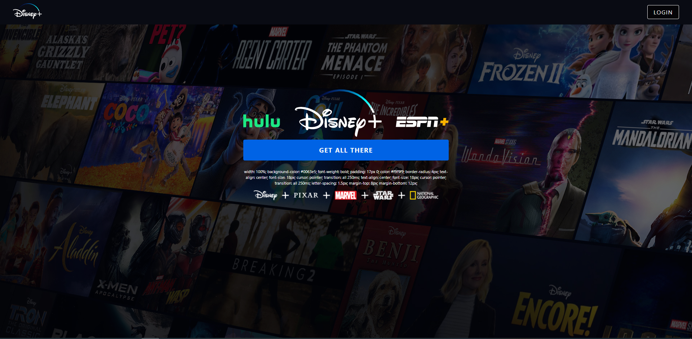

<h1 align="center">
  
   
  Disney Clone Built Using React.JS & Firebase
</h1>

  This is a Disney+ clone website built using <strong><em>React.JS</em></strong> as a Front-end & <strong><em>Firebase</em></strong> as Back-end. It's not a replica, and it     doesn't have all the features of Disney+ website. It's a similar version of Disney with some of the features.This project is showing my abilities in React.JS to build something advanced like Disney+. It contains the home page, login page, movie detail page.
     
  <strong><em>Here is the live version:</em></strong> https://netflix-cl-c7b15.web.app/ 

  
  # Login Page
  The Login Page Contains
  
  ***1-Header***
  ***2-Brand Logos***
  ***3-Login Button with Firebase Login Function***
  
 

   

# Header

The Header changes when user logs in and logs out.

# Home Page Slider
The Home Page Slider Contains
  
  ***A slider made with npm package called React-Slick.***
  ***Below the slider there is a section that contains the brands in Disney+. If the user hovers over them a background video will be played.***
  
 

   

# Home Page Movies
The Home Page Movies Contains
  
  ***The movies that fetched from firestore display with grid system ***
  ***When the user clicks on a movie it redirects you to Detail Page***
  
 

   

# Detail Page
The Detail Page Contains
  
  ***Details about the movie that user clicked in Home Page. ***
  ***It contains a background image of clicked movie in Home Page.***
  
 

   

